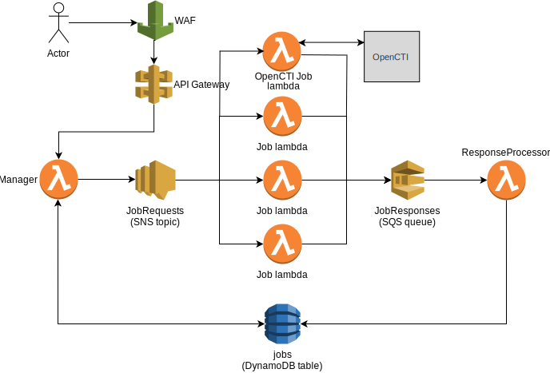
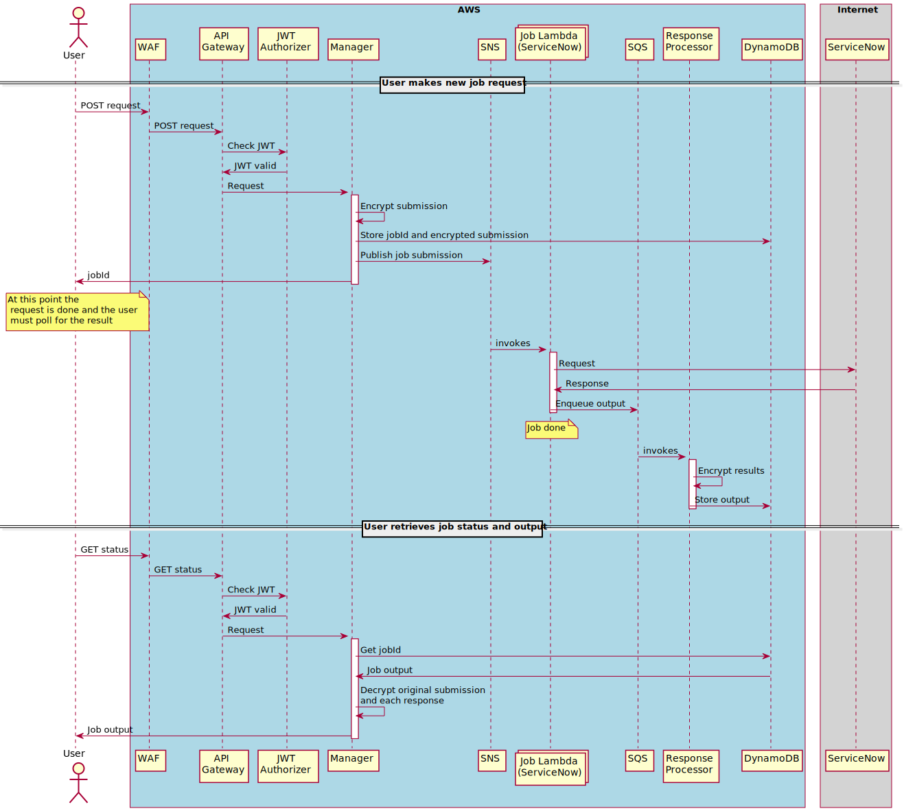
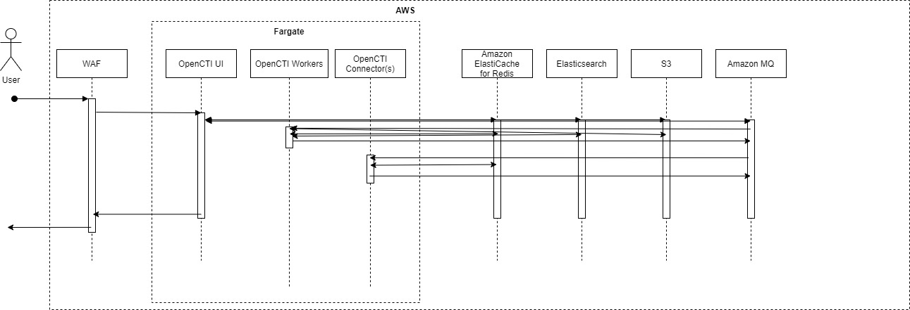

# Functional Diagram

## Threat Tools

* A custom authorizer verifies that all API Gateway requests have a valid JWT
* Incoming job requests are assigned a unique `jobId` (UUID), and are
  published to the `JobRequests` SNS topic
* Individual service lambdas are subscribed to the SNS topic, and are invoked
  whenever a message containing a request is published
* Each service lambda decides if it should contribute to the results of a
  requested job by examining a `modules` attribute in the original submission
* Each service lambda sends its output to the `JobResponses` SQS queue.
  For big outputs over 256Kb, they should be stored in special S3 bucket
  `gd-$AWS_DEV_TEAM-$AWS_DEV_ENV-threat-api-job-bucket`,
  so SQS contains only presigned URL to get full output
* The `ResponseProcessor` lambda is triggered by SQS queue submissions, and
  stores the provided output in DynamoDB
* Jobs may be queried by calling the API Gateway and specifying the `jobId`;
  available output from the various service lambdas will be returned to the
  caller

### Running Job as ECS Cluster Task
* New approach is to invoke Task inside ECS Cluster `api-ecstask-cluster`. Task has no time limits like AWS Lambda
* To support other interface ECS Task will be invoked from Boostrap Lambda similar to regular API module Lambda
* ECS Task receives all needed params via task definition and later it puts results in SQS queue mimicing old interface

### Notes on architecture

* Note that the WAF uses the default GoDaddy WAF rule set.  However, you need to have the rule `GenericRFI_BODY` overridden in the `AWS-AWSManagedRulesCommonRuleSet` rule set.  This rule blocks certain html in the body of requests, and we need that HTML for our API to function.

### Job Request Flow

## OpenCTI

### Functional

.

### Sequence

.