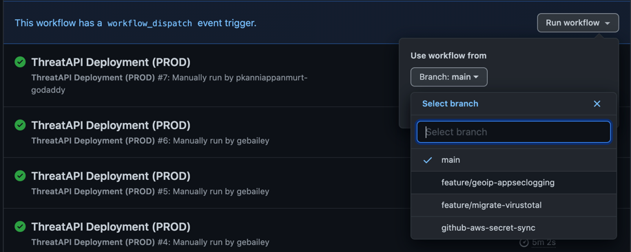
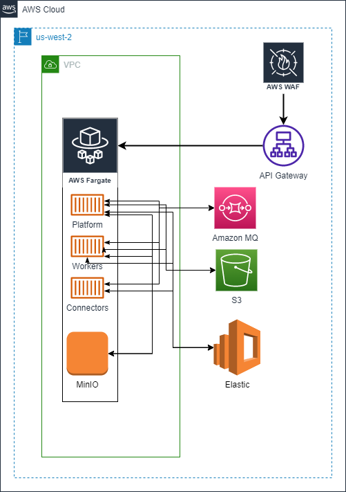

# Deployment Diagram

# Threat Tools CICD

## Secrets
- Can be accessed from [Settings -> Secrets](https://github.com/gdcorp-infosec/threat-api/settings/secrets/actions)
    - Needs admin access to create/ remove Secrets
    - Anyone with collaborator access to this repository can use these secrets for Actions
    - Secrets are not passed to workflows that are triggered by a pull request from a fork
    - [Github Docs](https://docs.github.com/en/actions/reference/encrypted-secrets) for more

- Github account `SVCOJtJzC2BlV1MvD-godaddy` is a Jomax service account targetted to be used for addition of secrets
    - `github.com` password for this username can be retrieved from AWS Secrets Manager
    - Created from the service account `SVCOJtJzC2BlV1MvD` with email address `SVCOJtJzC2BlV1MvD@godaddy.com` whose credentials can be retrieved from CyberArk
    - Part of `gdcorp-infosec` and `gdcorp-cp` organisations
    - PAT `threat-repo-github-actions` defined for usage with GitHub API, authorised by  `gdcorp-infosec`, `gdcorp-cp` & `gdcorp-actions`. Secret value is available through AWS Secrets Manager for team's access
    - PAT `github-aws-secrets-sync` defined for usage with GitHub API, authorised by  `gdcorp-infosec`. This GitHub PAT is setup with full repo and admin:org scopes as documented [here](https://github.com/gdcorp-actions/update-cloud-service-credentials#environment). Secret value is available through AWS Secrets Manager for team's access
      >NOTE: This is an extremely powerful token. This PAT is for the action to sync credentials from AWS Secrets Manager to Github Secrets **ONLY** and not used in any other context. Use `threat-repo-github-actions` for normal code checkouts.
    - SSH key pair `GITHUBCLOUD_SSH_PRIVATE_KEY` is attached and authorised by this account to clone private repositories with Go and from `github.com`. Secret value pair is available through AWS Secrets Manager with the same name for the team's access

- `025f610c17f9ecm` is a DC1 Service account to handle connections with `github.secureserver.net`
    - Secrets for DC1 can be accessed via OpenStack
    - `GITHUB_ACTIONS_GHC_SA` SSH key pair is linked with this account to handle repo clones from `github.secureserver.net`. The email address used for this key pair generation points to `SVCOJtJzC2BlV1MvD@godaddy.com`. Secret value pair is available through AWS Secrets Manager with the same name for the team's access

- AWS ephemeral self hosted runners are now available in our AWS CICD account.
  - The sceptre configs for the infrastructure is available at `sceptre/aws-runners`
  - It just requires a one time sceptre launch unless any changes are made to the sceptre script
  - Follow the instructions in [GHEC cicd guide here](https://github.com/gdcorp-engineering/cicd-docs/blob/main/ghec-cicd-guide.md#2---bootstrap-the-runners) to run them after changes
  - Use the below code snippet to choose the runner in your workflow

```yaml
    runs-on: [self-hosted,threat-runners]
```
### Github Actions code
- All workflows `.yml` must be placed under `.github/workflows` directory
- `dependabot.yml` lives in `.github/` and creates a PR if any new SHA is found on dependencies
- `pull_request_template.md` gives the standard check in pre-reqs before creating a PR

##### code-check.yml
- Triggers on every Pull Request made to `develop` branch
- Runs Tartufo as the first check
- On success of Tartufo triggers other subsequent jobs

##### deploy-role-secrets-sync.yml
- Runs a cron job scheduled weekly at 00:00 on Sunday UTC
- Can also be manually triggered if a sync is needed. Choose `develop` to run from
- Sync happens across all environments - dev-private, dev, production

##### deploy-to-dev-private.yml
- Manually triggered and not part of any CICD
- Make sure you choose your branch to trigger the deployment from
  

##### deploy-to-dev.yml
- Triggered on every merge into `develop`
- Can also be manually triggered via `workflow_dispatch`
  - The workflow will only succeed if triggered from `develop` branch
  - Although the other branches might be displayed, the jobs will be skipped thus terminating the workflow

##### deploy-to-prod.yml
- PR from `develop` to `main` is merged
- Can also be manually trigerred via `workflow_dispatch`
  - The workflow will only succeed if triggered from `main` branch
  - Although the other branches might be displayed, the jobs will be skipped thus terminating the workflow
- Workflow contains automation to create a change order ticket `InProgress` and `Complete` the ticket after a successful Prod deployment
  - Secrets used by change order automation are (All the secrets are stored in GitHub Secrets) :
    - SNOW_USER (Service account username for ServiceNow)
    - SNOW_PASS (Service account password for ServiceNow)
    - REPO_CLONE_TOKEN_SA_PAT (PAT to clone the `change-order-action` repository from `gdcorp-actions` )

# OpenCTI

