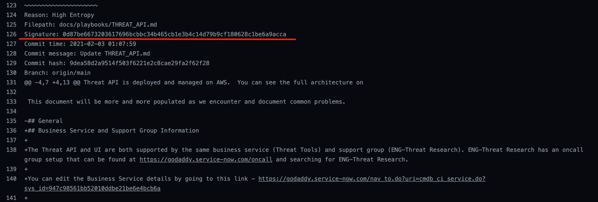

# ThreatTools API Development

### AWS Accounts

All AWS accounts are in the us-west-2 (Oregon) region.

| AWS Account | API Endpoint | Environment | Description
| --- | --- | --- | ---
| 345790377847 | https://api-private.threat.int.dev-gdcorp.tools | dev-private | Account for active development (non-CICD)
| 786677461057 | https://api.threat.int.dev-gdcorp.tools | dev | Account for active development (CICD)
| 338932590174 | https://api.threat.int.gdcorp.tools | prod | Production account (CICD)

### Authentication

* All endoints behind the API gateway require a valid JWT

* [THREAT-487](https://jira.godaddy.com/browse/THREAT-487) replaces the default
  JWTAuthorizer and enforces a [medium impact (non
  delegation)](https://confluence.godaddy.com/display/AUTH/Security+Tokens)
  token strength

* [THREAT-486](https://jira.godaddy.com/browse/THREAT-486) provides a library
  which individual APIs can use to verify JWT age

### JWTs

To obtain a JWT, you can use the [jwt.py](../tools/jwt.py) script.  The script
will prompt for a username and password, and then print out the JWT.

You may then pass this JWT to the ThreatTools API by setting the
`Authorization` header, using browser tools such as
[ModHeader](https://bewisse.com/modheader/).  The value of the header field
should be `sso-jwt` followed by the JWT, separated by a space character.

### Authorization

Authorization actions and required AD groups can be defined in the metadata for each lambda using the following format:

```json
actions: {
  "viewUsers": {
    "RequiredADGroups": ["ThreatIntel", ...]
  }
}
```

You can then use the _lambda toolbox_ (`lambdas/common/toolbox`) to check authorization in individual lambdas (using a specified list of JOMAX AD groups).  Simply call `Authorize` to see if a particular user can perform an action on a given resource.  Usually (for now) the resource will be the same as the lambda name.

### Standards / Best Practices

The Threat API repository uses the [git-flow](https://nvie.com/posts/a-successful-git-branching-model/) branching model. There are two branches
that should always be present, `main` and `develop`. The code in the `main` branch should always build successfully. Releases/tags are made off of this
`main` branch. The `develop` branch is where new features should be added. At the time of a release, the `develop` branch is merged back into the `main`
branch.

All branches should be named according to this convention:
* The branch name should always begin with `hotfix`, `bug`, or `feature`.
    * `hotfix` is for critical bugs found in production. A `hotfix` can be branched off of `main`, but must be merged into both `main` and `develop`.
    * `bug` is a non-critical bug addressed in a JIRA ticket. A `bug` should be branched off of `develop`.
    * `feature` addresses all other changes/additions and should be branched off of `develop`.
* Next is a forward slash divider.
* Finally, the human-readable portion of the branch name that is all in lowercase with dashes separating words.

As an example, a story for adding a new field to a module could have a branch name like, `feature/module-add-ssdeep-field`.

* Development of the ThreatTools API will follow the [CTO
  Guidelines](https://github.secureserver.net/CTO/guidelines/blob/master/Standards-Best-Practices/MustHaveShouldDo.md)
  for applications that are onboarding to AWS.  Alternative formatted document
  is
  [here](https://confluence.godaddy.com/display/AS/Phase+3+-+Must+Haves+to+go+to+Public+cloud).

* [GoDaddy API Design Standards](https://github.secureserver.net/CTO/guidelines/tree/master/api-design)

* [Best practices for REST API design](https://stackoverflow.blog/2020/03/02/best-practices-for-rest-api-design/)

* [Asynchronous REST operations](https://restcookbook.com/Resources/asynchroneous-operations/)

* [Tracing Fields](https://www.elastic.co/guide/en/ecs/current/ecs-tracing.html)

### Python Virtual Environment

A Python virtual environment is needed for tools like
[Sceptre](../sceptre/README.md), [Tartufo](#tartufo), and the [sample jwt.py
tool](../tools/jwt.py).

To create a Python virtual environment:

```bash
python3 -m venv ~/.threatvenv
source ~/.threatvenv/bin/activate
pip install -U pip
pip install -U -r requirements.txt -r requirements-test.txt
```

### Tartufo

[Tartufo](https://github.com/godaddy/tartufo) searches through git repositories
for high entropy strings and secrets, digging deep into commit history.  This
utility is used as a git pre-commit hook to avoid checking in such files to
GitHub.

This repository leverages [pre-commit](https://pre-commit.com/) to run various
tests before a git commit can proceed.  The tests are described in the
`.pre-commit-config.yaml` file in the top level directory of this repository.

The pre-commit utility is installed as part of the Python virtual environment
setup described above.

If you've just checked out this repository, you'll need to invoke the following
to install the pre-commit hook in your local git working tree:

```bash
pre-commit install
```

A tartufo scan will be run whenever `git commit` is performed.  To manually run
the pre-commit hooks, use the following command:

```bash
pre-commit run -a
```

To exclude particular exceptions within a file rather than the entire file:
- Get the signature from failure
  
- Add the signature to file pyproject.toml within exclude-signatures
- Include the reason on why the signature was excluded as a comment next to the signature

### Go Env setup

Because we rely on internal libraries, you need to configure go to be able to authenticate and download those libraries.

First we need to have git use ssh instead of prompt for user/pass for private repos:

```sh
git config --global url.git@github.secureserver.net:.insteadOf https://github.secureserver.net/
git config --global url.git@github.com:gdcorp-.insteadOf https://github.com/gdcorp-
```

Then if you run `cat ~/.gitconfig` you should see this addition

```sh
> cat ~/.gitconfig
[url "git@github.secureserver.net:"]
        insteadOf = https://github.secureserver.net/
[url "git@github.com:gdcorp-"]
        insteadOf = https://github.com/gdcorp-
```

Then set this env var whenever you run `go get`.  You may even need to run it multiple times if you haven't run it recently.  A good rule of thumb is whenever you are getting a `410 GONE` error, run this command again

```sh
export GOPRIVATE=github.secureserver.net,github.com/gdcorp-*
```

## Writing a lambda

Your lambda can be written in whatever language as long as it follows these input/output guidelines.

### Input

The input to the lambda will be a structure like the following

```json
{
  "jobId": "string", // Job id you are processing
  "submission": events.APIGatewayProxyRequest // The original API Gateway request for the job.
}
```

A few notes about the original request (`submission`):

* The body of the original API request will be in submission.body as a string
  * For the schema of a requested job, reference the [API Usage](USAGE.md#Requests) docs.
* The JWT will either be passed in via a cookie or authorization header.  This means you must not log out the full `submission` as it will contain the sensitive and private JWT.  You can use the `toolbox` library to pull out the JWT if you are writing your lambda in go.  You can then call the standard function `Authorize` (in the go toolbox or language equivalent) to check for permissions.

### Output

The output you must return after completing your lambda will be the following.
This is denoted as a `CompletedJob`.  Note that you pass an array of completed jobs because
each lambda can technically accept and array of jobs to handle.

```json
[
  {
  "jobId": "string", // The job ID that this data should be added to
  "module_name": "string", // The name of this module
  "response": "string", // Marshalled response data
  },
  ...
]
```

### Tracing

Tracing helps us understand what's going on inside each lambda.  We use ELK APM as our tracing server.

In order to add tracing to your lambda, start by making sure your lambda creates the toolbox, and closes it after it's done executing.  This creates the default tracer.  It uses ENV vars to point to the right server.

EX:

```go
t := toolbox.GetToolbox()
defer t.Close(ctx)
```

You can make sure you are setting these env vars correctly by viewing another lambda, or the go APM setup instructions in our APM server.  The env vars are

* ELASTIC_APM_SERVICE_NAME
* ELASTIC_APM_SERVER_URL
* ELASTIC_APM_SECRET_TOKEN

To create a trace, follow the below pattern

```go
var span opentracing.Span
span, ctx = opentracing.StartSpanFromContext(ctx, "NameOfYourTrace")
```

Then for any sub spans, you can simply write the same code again using the newly created context.

Note that you must always close your span, so make sure in all logical flows of your code, your spans will always be closed.
