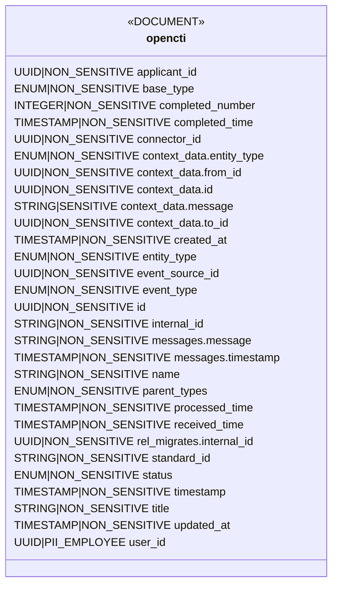
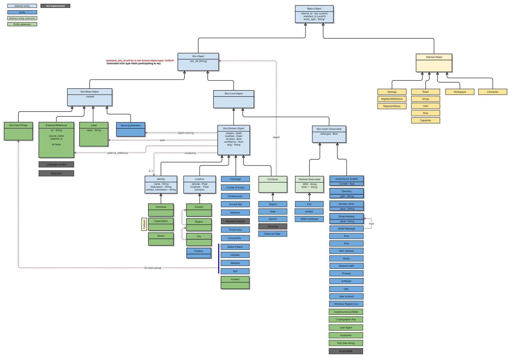
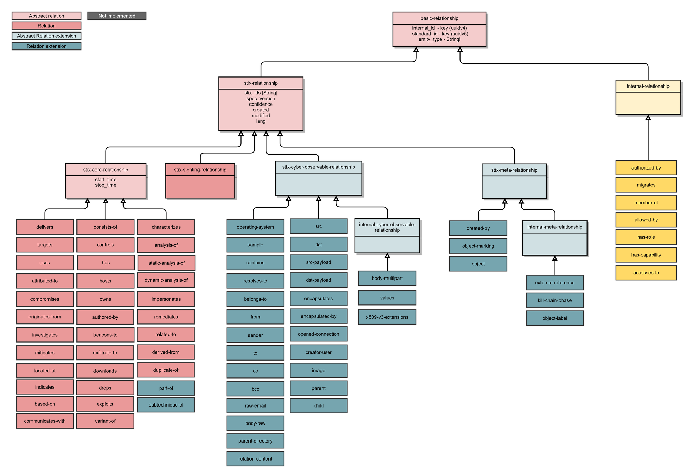

# OpenCTI Data

OpenCTI stores its data in Elastic. The Elastic schema for implementing the different types of objects required by OpenCTI looks as follows:

OpenCTI implements the STIX standard for representing threat intelligence. It does this by implementing schema for two different types of objects: entities and relations. Entities are things like organizations, malware, and events. Relations are connects between any two entities. For example, there may be an IP address entity and a domain name entity with a relation describing how the domain name resolves to the IP, which defines three objects in the database.

The following entity and relation schemas come from the [Luatix documentation](https://luatix.notion.site/Data-model-4427344d93a74fe194d5a52ce4a41a8d) for the public [OpenCTI project](https://github.com/OpenCTI-Platform/opencti).

