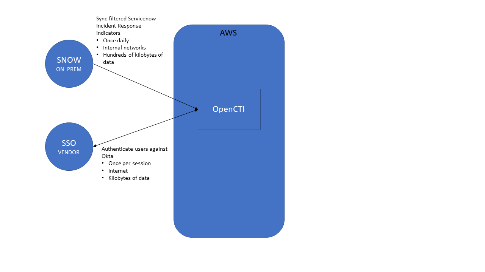

# OpenCTI Dependency

The OpenCTI service is tier 4 (lowest) priority for avaiability. Degradation or loss of the service will have no impact on GoDaddy business and only minor impact on the larger Threat Tools system. Impacts would be loss of data that would be copied from third-party API responses into OpenCTI for long-term storage.

Our OpenCTI instance has only a few dependencies.
- Okta for SSO to enable interactive user logins.
- Servicenow's Incident Response module stores indicators added by Incident Response analysts during their investigations. These indicators will be backfilled into OpenCTI to cross-reference with data acquired from other sources.

