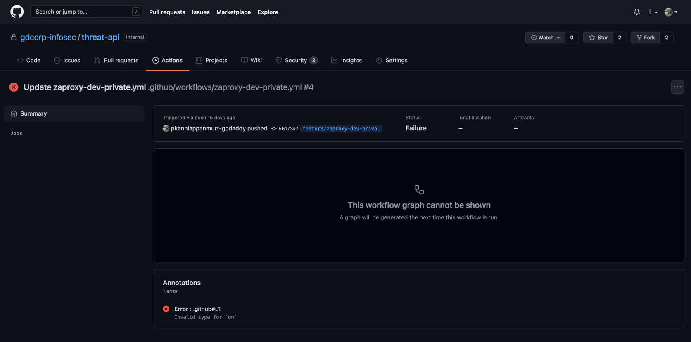

# Github Actions CICD

- The errors from the GithubActions tab should be self-explanatory for the error
- In most cases it should be syntax errors. Refer the [official doc](https://docs.github.com/en/actions/learn-github-actions/workflow-syntax-for-github-actions)
  for syntax

