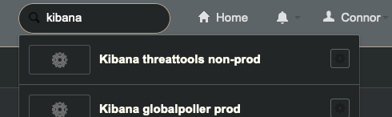
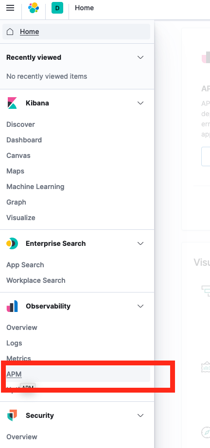

# Threat API

Threat API is deployed and managed on AWS.  You can see the full architecture on the [architecture diagram](../ARCHITECTURE.md).

This document will be more and more populated as we encounter and document common problems.

## Business Service and Support Group Information

The Threat API and UI are both supported by the same business service (Threat Tools) and support group (ENG-Threat Research). ENG-Threat Research has an oncall group setup that can be found at https://godaddy.service-now.com/oncall and searching for ENG-Threat Research. 

You can edit the Business Service details by going to this link - https://godaddy.service-now.com/nav_to.do?uri=cmdb_ci_service.do?sys_id=947c98561bb52010ddbe21be6e4bcb6a

## General Troubleshooting

For most app level errors and problems, check the [ELK Stack APM Server](https://threattools-non-prod.kibana.int.gdcorp.tools/app/apm) (sign in via okta).  It will most likely have errors that would provide the best trail to follow.

APM Instructions

Log in to the kibana instance from okta

Find the APM selection in the sidebar

From there you can click in to an individual service and view traces (example TODO).

## Gateway is not calling a lambda

Check the connection and permissions from the gateway to the lambda.  This will most likely be sceptre changes.  Check for error codes and dig deeper based on them.

## Lambda is not being run

If you notice that your lambda is not being run, it is most likely a problem with the connection to the SNS topic.  Currently, on every job triggering, each lambda should trigger.  And it's up to the lambda to determine if it should run and generate results.  So if you lambda is not running, it is not listening to the SNS topic properly.

Make sure the lambda is set up to be triggered from the proper SNS topic, and review the sceptre files for this.  If your lambda is still not running, check it's execution role, it should use the threat lambda execution role.

## Lambda results are not loading in to DynamoDB

If your lambda is definitely running (it runs and sends logs to cloudwatch), but the results are not populating to DynamoDB, here's what you should do to debug.

The problem is most likely directly between your lambda and Dynamodb.  Check out the [architecture](../ARCHITECTURE.md) docs to see the elements in between.

1. First check to make sure the response processor is picking up on your result.  Your lambda should be sending the results to the SQS queue that then is processed by the response processor.  Check to make sure your lambda has this destination set up.
1. Next check the logs of the response processor, this is the most likely place of error.  If your results are sent in the wrong format, the response processor will log it.
1. Next check if the result is being populated to DynamoDB.  If it is, great, it's likely just the manager lambda not properly decrypting and returning the results via the API. If not, it's worth doing deeper debugging in the response processor to check for code bugs or other errors.  See APM Instructions.
1. If you check all these spots, but none show an indication of failure, it's probably worth doing deeper debugging in the code of the response processor, and manager lambda, depending on what is not working.
