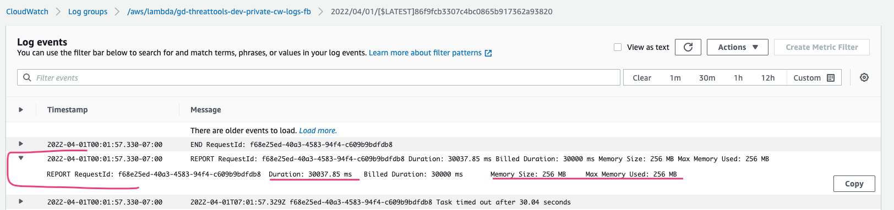

1) From the alerts get the following information
   1) AccountID - narrows down which account to look for logs
   2) Alarm description - Reason for the alarm
   3) Dimensions/ Log Groups/ Lambda function names
      1) Eg, Dimensions "[{"value":"gd-threattools-dev-private-cw-logs-fb","name":"FunctionName"}]"

2) Try to narrow down the services to inspect from the above metrics
   1) In this case, the alarm was about the iterator age exceeding the set threshold value(1800000 milliseconds). Iterator age is the age of the stream records that were just processed by your function.
   So we'll narrow down the services to the kinesis streams and the respective lambdas to process the picked up data from streams
   2) From the Dimensions:Value highlighted above, it the "cw" cloudwatch logs stream

3) Dig in the logs for the time around the alert.
   1) 
   2) Updated from 128->256 MB the last time the alarm ran
      1) Looking at other metrics there is a `fb_log_level` that is set to `info`. Changed it to `debug`, as per recommendation from #essp-onboarding
   3) There is also a lambda timeout at 30 secs. Increased to 60 secs

4) Resync the corresponding account, environment from PCP to reflect changes

5) Test if the logs reduced from the corresponding lambda where the log level was decreased - `/aws/lambda/gd-threattools-dev-private-cw-logs-fb`
6) Test if the change in logs doesn't break the kibana dashboards.
